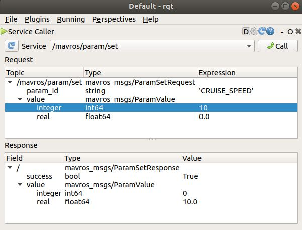
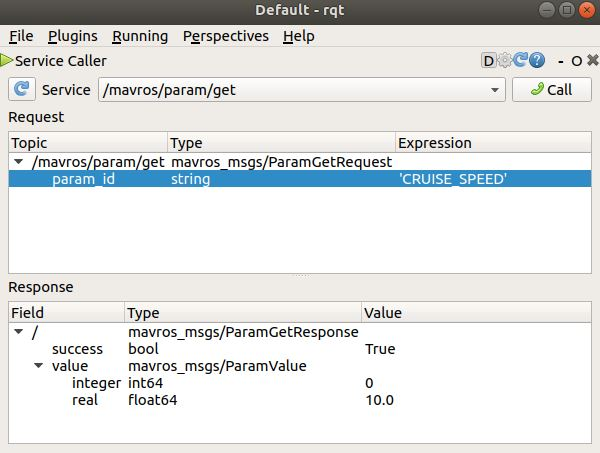

# How to Get/Set parameters of Ardupilot-SITL Rover

*Author:* Masoud Iranmehr

*Github Page:* [github.com/masoudir/mavros_tutorial](https://github.com/masoudir/mavros_tutorial)

# Initialize

Please follow steps mentioned in this [link](../index.md)

# Get/Set MAVROS Parameters

## Get/Set MAVROS Parameters using MAVProxy or Ardupilot-SITL

If you want to set a parameter, you can just use this command:

* `param set PARAMETER VALUE` - Sets the new value for the parameter

And if you want to set a parameter, you can just use this command:

* `param fetch PARAMETER` - Gets the value of the parameter

Or

* `param show PARAMETER` - Gets the value of the parameter

For example, if you want to consider "CRUISE_SPEED" as your parameter, you can use these commands to get or set it:

* `param set CRUISE_SPEED 20` - Sets the new value for the parameter

* `param fetch CRUISE_SPEED` - Gets the value of the parameter

Or

* `param show CRUISE_SPEED` - Gets the value of the parameter

## Get/Set MAVROS Parameters using ROS rqt:

At first you need to add two plugin from rqt:

    Plugins -> Services -> Service Caller
    
If you want to set a parameter, then in "Service Caller" side, you have to select *"/mavros/param/set"* and then in the 
field of "param_id", you can enter your name of parameter and then in the field of "integer" or "real" you can set a new
value for that parameter. Then click on "call" button to send this message. The example result for parameter 
"CRUISE_SPEED" should be as follow:

As you can see the output constitutes a "success" field which is in bool type (False/True) and indicates that this 
process was successfully done or not. Also the new value of this parameter will be shown on this screen as you see.

It is noted that there is not any differences between "integer" and "real" when your value is in integer format.

If you want to set a parameter, then in "Service Caller" side, you have to select *"/mavros/param/get"* and then in the 
field of "param_id", you can enter your name of parameter and then in the field of "integer" or "real" you can set a new
value for that parameter. Then click on "call" button to send this message. The example result for parameter 
"CRUISE_SPEED" should be as follow:

As you can see the output constitutes a "success" field which is in bool type (False/True) and indicates that this 
process was successfully done or not. Also the new value of this parameter will be shown on this screen as you see.

## Change vehicle mode using ROS command lines

If you want to set a parameter value you need to call a ros service in order to do that. Just follow these commands:

* `rosservice info /mavros/param/set` - To see the details of this service

This command gives you this result:

    Node: /mavros
    URI: rosrpc://ubuntu:58491
    Type: mavros_msgs/ParamSet
    Args: param_id value

"mavros_msgs/ParamSet" is the type of this service srv file and "Args" are our input arguments, but we have to know their
 types, so that we type this command:

* `rossrv show mavros_msgs/ParamSet` - Getting details of the mentioned srv file

This will result as below:

    string param_id
    mavros_msgs/ParamValue value
      int64 integer
      float64 real
    ---
    bool success
    mavros_msgs/ParamValue value
      int64 integer
      float64 real

In this case, "param_id" is the name of parameter needs to being configured and its type is "string". Also "integer" and 
"real" are the fields describing the value of this parameter.

For setting the parameter with the new value, you can rus this command:

* `rosservice call /mavros/param/set "{'param_id':'PARAM', 'value':[INTEGER_VALUE, REAL_VALUE]}"` - Changes the value of parameter

For example for the parameter of "CRUISE_SPEED":

* `rosservice call /mavros/param/set "{'param_id':'CRUISE_SPEED', 'value':[20, 0]}"` - Changes the value of parameter

And if you want to get the value of a parameter:

* `rosservice call /mavros/param/get "{'param_id':'PARAM'}"` - Change vehicle mode to "GUIDED"

For example for the parameter of "CRUISE_SPEED":

* `rosservice call /mavros/param/get "{'param_id':'CRUISE_SPEED'}"`- Gets the variable of the parameter

## Change vehicle mode using rosun commands

* `rosrun mavros mavparam set PARAM VALUE` - Changes the value of PARAM to VALUE

* `rosrun mavros mavparam get PARAM` - Returns the value of PARAM
