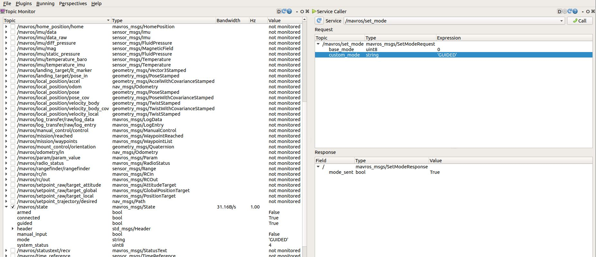

# How to move Ardupilot-SITL Rover

*Author:* Masoud Iranmehr

*Github Page:* [github.com/masoudir/Ardupilot_MAVROS_Examples](https://github.com/masoudir/Ardupilot_MAVROS_Examples)

# Initialize

Please follow steps mentioned in this [link](../index.md). Then you need to change the mode of your vehicle to "GUIDED"
using this [link](Step1_How_to_change_mode.md) then you have to ARM your robot using one of the mentioned methods on this
[link]. Then it is time to move your vehicle which is described here. 

# Move your vehicle

## Move your vehicle using MAVProxy or Ardupilot-SITL

We assume that your vehicle is in "GUIDED" mode, if it's not please follow the links mentioned in "Initialize" sector on
this page. Then move your vehicle using this command in MAVproxy or SITL:

* `GUIDED lat lon alt` - Move vehicle to specified destination

Parameters of (lat, lon, alt) are the location parameters to determive the destination of the vehicle.

Then if you want to stop vehicle from moving, you need this command:

* `mode HOLD` - Stops the vehicle

## Move your vehicle using ROS rqt:

We assume that your vehicle is in "GUIDED" mode, if it's not please follow the links mentioned in "Initialize" sector on
this page. Then you need to Add two plugin from rqt:

    Plugins -> Topics -> Topic Monitor
    Plugins -> Services -> Service Caller
    
Then in "Topic Monitor" side, you have to tick the topic of "/mavros/state" to view its contents, so that you can get 
the vehicle mode and also some other parameters such as "arm status" and "Guided status".

Then in "Service Caller" side, you have to select "/mavros/set_mode" and then in the field of "custom_mode", you can set
your vehicle mode. Then click on "call" button to send this message. The result should be as follow:

## Change vehicle mode using ROS command lines

You need to call a ros service in order to do that. Just follow these commands:

* `rosservice info /mavros/set_mode` - To see its arguments and type of its Class Message

This command gives you this result:

    Node: /mavros
    URI: rosrpc://ubuntu:42571
    Type: mavros_msgs/SetMode
    Args: base_mode custom_mode

"mavros_msgs/SetMode" is the type of this service srv file and "Args" are our input arguments, but we have to know their types, so that we type this command:

* `rossrv show mavros_msgs/SetMode` - Getting details of the mentioned srv file

This will result as below:

    uint8 MAV_MODE_PREFLIGHT=0
    uint8 MAV_MODE_STABILIZE_DISARMED=80
    uint8 MAV_MODE_STABILIZE_ARMED=208
    uint8 MAV_MODE_MANUAL_DISARMED=64
    uint8 MAV_MODE_MANUAL_ARMED=192
    uint8 MAV_MODE_GUIDED_DISARMED=88
    uint8 MAV_MODE_GUIDED_ARMED=216
    uint8 MAV_MODE_AUTO_DISARMED=92
    uint8 MAV_MODE_AUTO_ARMED=220
    uint8 MAV_MODE_TEST_DISARMED=66
    uint8 MAV_MODE_TEST_ARMED=194
    uint8 base_mode
    string custom_mode
    ---
    bool mode_sent

In this case, "custom_mode" is the parameter needs to being configured and its type is "string". For example if you want to change the vehicle 
mode to "GUIDED" follow this command:

* `rosservice call /mavros/set_mode "custom_mode: 'GUIDED'"` - Change vehicle mode to "GUIDED"

Another method is to use "rosrun" command:

* `rosrun mavros mavsys mode -c MANUAL` - If you want to change mode to "MANUAL"

* `rosrun mavros mavsys mode -b <ENUM VALUE>` - If you want to use "base_mode" to change mode

